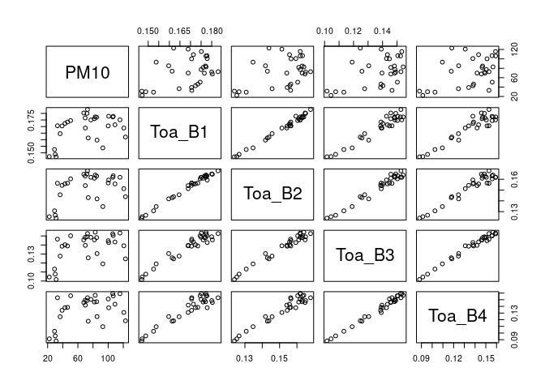
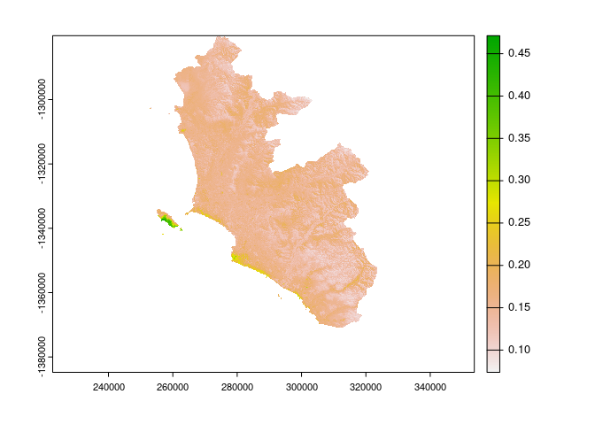
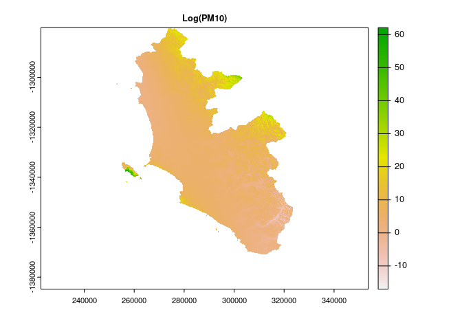

### Librerias

```r
library(sf)
```

```
## Linking to GEOS 3.10.2, GDAL 3.4.1, PROJ 8.2.1; sf_use_s2() is TRUE
```

```r
library(terra)
```

```
## terra 1.6.17
```

```r
library(gstat)
library(MASS)
```

```
## 
## Attaching package: 'MASS'
```

```
## The following object is masked from 'package:terra':
## 
##     area
```
### Lectura de archivos externos


```r
### Lectura de las bandas del satelite
# dia 30/04/2022
banda1_30_04<-rast('dia_30_04_2022/LC09_L1TP_007068_20220430_20220430_02_T1_B1.TIF')
banda2_30_04<-rast('dia_30_04_2022/LC09_L1TP_007068_20220430_20220430_02_T1_B2.TIF')
banda3_30_04<-rast('dia_30_04_2022/LC09_L1TP_007068_20220430_20220430_02_T1_B3.TIF')
banda4_30_04<-rast('dia_30_04_2022/LC09_L1TP_007068_20220430_20220430_02_T1_B4.TIF')

# dia 16/05/2022
banda1_16_05<-rast('dia_16_05_2022/LC09_L1TP_007068_20220516_20220516_02_T1_B1.TIF')
banda2_16_05<-rast('dia_16_05_2022/LC09_L1TP_007068_20220516_20220516_02_T1_B2.TIF')
banda3_16_05<-rast('dia_16_05_2022/LC09_L1TP_007068_20220516_20220516_02_T1_B3.TIF')
banda4_16_05<-rast('dia_16_05_2022/LC09_L1TP_007068_20220516_20220516_02_T1_B4.TIF')

# dia 1/06/2022
banda1_01_06<-rast('dia_01_06_2022/LC09_L1TP_007068_20220601_20220602_02_T1_B1.TIF')
banda2_01_06<-rast('dia_01_06_2022/LC09_L1TP_007068_20220601_20220602_02_T1_B2.TIF')
banda3_01_06<-rast('dia_01_06_2022/LC09_L1TP_007068_20220601_20220602_02_T1_B3.TIF')
banda4_01_06<-rast('dia_01_06_2022/LC09_L1TP_007068_20220601_20220602_02_T1_B4.TIF')

# dia 9/06/2022
banda1_09_06<-rast('dia_09_06_2022/LC08_L1TP_007068_20220609_20220616_02_T1_B1.TIF')
banda2_09_06<-rast('dia_09_06_2022/LC08_L1TP_007068_20220609_20220616_02_T1_B2.TIF')
banda3_09_06<-rast('dia_09_06_2022/LC08_L1TP_007068_20220609_20220616_02_T1_B3.TIF')
banda4_09_06<-rast('dia_09_06_2022/LC08_L1TP_007068_20220609_20220616_02_T1_B4.TIF')

setMinMax(banda1_30_04)
setMinMax(banda1_16_05)
setMinMax(banda1_09_06)
setMinMax(banda1_01_06)
setMinMax(banda2_30_04)
setMinMax(banda2_16_05)
setMinMax(banda2_09_06)
setMinMax(banda2_01_06)
setMinMax(banda3_30_04)
setMinMax(banda3_16_05)
setMinMax(banda3_09_06)
setMinMax(banda3_01_06)
setMinMax(banda4_30_04)
setMinMax(banda4_16_05)
setMinMax(banda4_09_06)
setMinMax(banda4_01_06)

### Lectura del archivo que contiene el mapa del Peru
Peru<-read_sf('gadm41_PER_shp/gadm41_PER_1.shp')

### Coordenadas de las estaciones, longitud y latitud
est1<-st_point(c(-77.03364,-11.90219)) # Carabayllo
est2<-st_point(c(-77.08447,-12.00889)) # SMP
est3<-st_point(c(-77.04322,-12.07054)) # Campo de Marte
est4<-st_point(c(-77.00769,-12.10859)) # San Borja
est5<-st_point(c(-76.92706,-12.02869)) # Huachipa
est6<-st_point(c(-76.97144,-12.04302)) # Sta Anita
est7<-st_point(c(-76.99925,-11.98164)) # SJL
est8<-st_point(c(-76.92,-12.16639)) # VMT

### Transformacion de las estaciones como datos geometricos, proyeccion de las coordendas
estcs<-st_sfc(est1,est2,est3,est4,est5,est6,est7,est8,crs=4326)
estcs_p<-st_transform(estcs,crs(banda1_30_04))

# Coordenadas por separado
X<-st_coordinates(estcs_p)[,1]
Y<-st_coordinates(estcs_p)[,2]

### Mapa de Lima Metropolitana, proyectado a las mismas coordenadas de los datos satelitales
Lima<-st_transform(Peru[c(7,16),4],crs(banda1_30_04))
```


### Creacion de coordenadas y variables


```r
### Definicion del data frame 30/04/2022
B1<-extract(banda1_30_04,st_sf(estcs_p))[,2]
Toa_B1<-(B1*0.00002-0.1)/sin(51.68072692*pi/180)
B2<-extract(banda2_30_04,st_sf(estcs_p))[,2]
Toa_B2<-(B2*0.00002-0.1)/sin(51.68072692*pi/180)
B3<-extract(banda3_30_04,st_sf(estcs_p))[,2]
Toa_B3<-(B3*0.00002-0.1)/sin(51.68072692*pi/180)
B4<-extract(banda4_30_04,st_sf(estcs_p))[,2]
Toa_B4<-(B4*0.00002-0.1)/sin(51.68072692*pi/180)

DT1<-data.frame(
        Lugar=c('CRB','SMP','CMar','SB','HCHP','STA','SJL','VMT'),X=as.vector(X),
        Y=as.vector(Y),
        Fecha='30/04/2022',
        PM10=c(106.1,39.1,29.1,85.3,120.7,82.9,109,115.6),
        Toa_B1,Toa_B2,Toa_B3,Toa_B4)
#ests_sf<-st_sf(ests_atrib,geometry=estcs_p)

### Definicion del data frame 16/05/2022
B1<-extract(banda1_16_05,st_sf(estcs_p))[,2]
Toa_B1<-(B1*0.00002-0.1)/sin(48.80278526*pi/180)
B2<-extract(banda2_16_05,st_sf(estcs_p))[,2]
Toa_B2<-(B2*0.00002-0.1)/sin(48.80278526*pi/180)
B3<-extract(banda3_16_05,st_sf(estcs_p))[,2]
Toa_B3<-(B3*0.00002-0.1)/sin(48.80278526*pi/180)
B4<-extract(banda4_16_05,st_sf(estcs_p))[,2]
Toa_B4<-(B4*0.00002-0.1)/sin(48.80278526*pi/180)

DT2<-data.frame(
        Lugar=c('CRB','SMP','CMar','STA','SJL','VMT'),X=as.vector(X[c(-4,-5)]),
        Y=as.vector(Y[c(-4,-5)]),
        Fecha='16/05/2022',
        PM10=c(106.7,42.9,30,77.2,81.8,100.1),Toa_B1=Toa_B1[c(-4,-5)],
        Toa_B2=Toa_B2[c(-4,-5)],
        Toa_B3=Toa_B3[c(-4,-5)],
        Toa_B4=Toa_B4[c(-4,-5)])
#ests_sf<-st_sf(ests_atrib,geometry=estcs_p)

### Data frame 01/06/2022
B1<-extract(banda1_01_06,st_sf(estcs_p))[,2]
Toa_B1<-(B1*0.00002-0.1)/sin(46.42011036*pi/180)
B2<-extract(banda2_01_06,st_sf(estcs_p))[,2]
Toa_B2<-(B2*0.00002-0.1)/sin(46.42011036*pi/180)
B3<-extract(banda3_01_06,st_sf(estcs_p))[,2]
Toa_B3<-(B3*0.00002-0.1)/sin(46.42011036*pi/180)
B4<-extract(banda4_01_06,st_sf(estcs_p))[,2]
Toa_B4<-(B4*0.00002-0.1)/sin(46.42011036*pi/180)

DT3<-data.frame(
        Lugar=c('CRB','SMP','CMar','SB','HCHP','STA','SJL','VMT'),X=as.vector(X),
        Y=as.vector(Y),
        Fecha='01/06/2022',
        PM10=c(72.7,46.3,31.2,93,100.7,84.8,72,50.4),Toa_B1,Toa_B2,Toa_B3,
        Toa_B4)

### Definicion del data frame 09/06/2022
B1<-extract(banda1_09_06,st_sf(estcs_p))[,2]
Toa_B1<-(B1*0.00002-0.1)/sin(45.65514607*pi/180)
B2<-extract(banda2_09_06,st_sf(estcs_p))[,2]
Toa_B2<-(B2*0.00002-0.1)/sin(45.65514607*pi/180)
B3<-extract(banda3_09_06,st_sf(estcs_p))[,2]
Toa_B3<-(B3*0.00002-0.1)/sin(45.65514607*pi/180)
B4<-extract(banda4_09_06,st_sf(estcs_p))[,2]
Toa_B4<-(B4*0.00002-0.1)/sin(45.65514607*pi/180)

DT4<-data.frame(
        Lugar=c('CRB','SMP','CMar','SB','HCHP','STA','SJL','VMT'),X=as.vector(X),
        Y=as.vector(Y),
        Fecha='09/06/2022',
        PM10=c(69.8,36.5,22.2,73.7,122.9,69.6,67.8,33),Toa_B1,
        Toa_B2,Toa_B3,Toa_B4)

dt<-rbind(DT1,DT2,DT3,DT4)
#ests_sf<-st_sf(ests_atrib,geometry=estcs_p)
```


```r
pairs(dt[,5:9])
```

<!-- -->


```r
## Toa_B1
modelo<-lm(log(PM10)~(X+Y+Toa_B1)^2+I(X^2)+I(Y^2)+I(Toa_B1^2),data=rbind(DT1,DT2,DT3))
modelo_b<-stepAIC(modelo)
```

```
## Start:  AIC=-56.94
## log(PM10) ~ (X + Y + Toa_B1)^2 + I(X^2) + I(Y^2) + I(Toa_B1^2)
## 
##               Df Sum of Sq     RSS     AIC
## - I(X^2)       1  0.001140 0.66741 -58.899
## - Y:Toa_B1     1  0.008190 0.67446 -58.667
## - I(Toa_B1^2)  1  0.011430 0.67770 -58.562
## - X:Y          1  0.040003 0.70627 -57.653
## - I(Y^2)       1  0.046881 0.71315 -57.440
## <none>                     0.66627 -56.936
## - X:Toa_B1     1  0.070000 0.73627 -56.738
## 
## Step:  AIC=-58.9
## log(PM10) ~ X + Y + Toa_B1 + I(Y^2) + I(Toa_B1^2) + X:Y + X:Toa_B1 + 
##     Y:Toa_B1
## 
##               Df Sum of Sq     RSS     AIC
## - I(Toa_B1^2)  1  0.010491 0.67790 -60.555
## - Y:Toa_B1     1  0.014957 0.68237 -60.411
## <none>                     0.66741 -58.899
## - X:Toa_B1     1  0.089480 0.75689 -58.131
## - I(Y^2)       1  0.129042 0.79645 -57.010
## - X:Y          1  0.131795 0.79921 -56.934
## 
## Step:  AIC=-60.56
## log(PM10) ~ X + Y + Toa_B1 + I(Y^2) + X:Y + X:Toa_B1 + Y:Toa_B1
## 
##            Df Sum of Sq     RSS     AIC
## <none>                  0.67790 -60.555
## - Y:Toa_B1  1   0.11744 0.79534 -59.041
## - I(Y^2)    1   0.21055 0.88845 -56.605
## - X:Y       1   0.22390 0.90180 -56.277
## - X:Toa_B1  1   0.78237 1.46027 -45.673
```

```r
summary(modelo_b)
```

```
## 
## Call:
## lm(formula = log(PM10) ~ X + Y + Toa_B1 + I(Y^2) + X:Y + X:Toa_B1 + 
##     Y:Toa_B1, data = rbind(DT1, DT2, DT3))
## 
## Residuals:
##      Min       1Q   Median       3Q      Max 
## -0.49791 -0.07689  0.03244  0.09338  0.34272 
## 
## Coefficients:
##               Estimate Std. Error t value Pr(>|t|)   
## (Intercept)  6.179e+03  3.378e+03   1.829  0.08878 . 
## X            1.852e-02  8.009e-03   2.312  0.03650 * 
## Y            1.290e-02  6.335e-03   2.037  0.06101 . 
## Toa_B1      -2.435e+03  2.880e+03  -0.845  0.41212   
## I(Y^2)       5.993e-09  2.874e-09   2.085  0.05583 . 
## X:Y          1.289e-08  5.993e-09   2.150  0.04949 * 
## X:Toa_B1    -7.689e-03  1.913e-03  -4.020  0.00127 **
## Y:Toa_B1    -3.459e-03  2.221e-03  -1.557  0.14170   
## ---
## Signif. codes:  0 '***' 0.001 '**' 0.01 '*' 0.05 '.' 0.1 ' ' 1
## 
## Residual standard error: 0.22 on 14 degrees of freedom
## Multiple R-squared:  0.8518,	Adjusted R-squared:  0.7777 
## F-statistic:  11.5 on 7 and 14 DF,  p-value: 7.505e-05
```

```r
## evaluacion
mean((DT4$PM10-exp(predict(modelo_b,DT4)))^2)
```

```
## [1] 2147.734
```


```r
## Toa_B2
modelo<-lm(log(PM10)~(X+Y+Toa_B2)^2+I(X^2)+I(Y^2)+I(Toa_B2^2),data=rbind(DT1,DT2,DT3))
modelo_b<-stepAIC(modelo)
```

```
## Start:  AIC=-58.52
## log(PM10) ~ (X + Y + Toa_B2)^2 + I(X^2) + I(Y^2) + I(Toa_B2^2)
## 
##               Df Sum of Sq     RSS     AIC
## - I(Toa_B2^2)  1  0.000003 0.61990 -60.523
## - I(X^2)       1  0.013158 0.63306 -60.061
## - X:Y          1  0.032211 0.65211 -59.409
## - Y:Toa_B2     1  0.040806 0.66070 -59.121
## - I(Y^2)       1  0.048556 0.66845 -58.864
## <none>                     0.61990 -58.523
## - X:Toa_B2     1  0.109320 0.72922 -56.950
## 
## Step:  AIC=-60.52
## log(PM10) ~ X + Y + Toa_B2 + I(X^2) + I(Y^2) + X:Y + X:Toa_B2 + 
##     Y:Toa_B2
## 
##            Df Sum of Sq     RSS     AIC
## - I(X^2)    1   0.01580 0.63570 -61.969
## - X:Y       1   0.05111 0.67101 -60.780
## <none>                  0.61990 -60.523
## - I(Y^2)    1   0.07540 0.69530 -59.998
## - Y:Toa_B2  1   0.12278 0.74268 -58.548
## - X:Toa_B2  1   0.68287 1.30277 -46.184
## 
## Step:  AIC=-61.97
## log(PM10) ~ X + Y + Toa_B2 + I(Y^2) + X:Y + X:Toa_B2 + Y:Toa_B2
## 
##            Df Sum of Sq     RSS     AIC
## <none>                  0.63570 -61.969
## - Y:Toa_B2  1   0.14000 0.77570 -59.591
## - X:Y       1   0.25778 0.89349 -56.481
## - I(Y^2)    1   0.26698 0.90268 -56.255
## - X:Toa_B2  1   0.71601 1.35171 -47.373
```

```r
summary(modelo_b)
```

```
## 
## Call:
## lm(formula = log(PM10) ~ X + Y + Toa_B2 + I(Y^2) + X:Y + X:Toa_B2 + 
##     Y:Toa_B2, data = rbind(DT1, DT2, DT3))
## 
## Residuals:
##      Min       1Q   Median       3Q      Max 
## -0.51235 -0.08387  0.02001  0.09864  0.32324 
## 
## Coefficients:
##               Estimate Std. Error t value Pr(>|t|)   
## (Intercept)  7.212e+03  3.209e+03   2.247  0.04129 * 
## X            2.016e-02  8.055e-03   2.502  0.02534 * 
## Y            1.478e-02  6.161e-03   2.398  0.03097 * 
## Toa_B2      -2.952e+03  2.608e+03  -1.132  0.27666   
## I(Y^2)       6.874e-09  2.835e-09   2.425  0.02944 * 
## X:Y          1.439e-08  6.041e-09   2.383  0.03191 * 
## X:Toa_B2    -6.198e-03  1.561e-03  -3.971  0.00139 **
## Y:Toa_B2    -3.532e-03  2.011e-03  -1.756  0.10095   
## ---
## Signif. codes:  0 '***' 0.001 '**' 0.01 '*' 0.05 '.' 0.1 ' ' 1
## 
## Residual standard error: 0.2131 on 14 degrees of freedom
## Multiple R-squared:  0.861,	Adjusted R-squared:  0.7916 
## F-statistic: 12.39 on 7 and 14 DF,  p-value: 4.897e-05
```

```r
# Eval
mean((DT4$PM10-exp(predict(modelo_b,DT4)))^2)
```

```
## [1] 1767.908
```


```r
## Toa_B3
modelo<-lm(log(PM10)~(X+Y+Toa_B3)^2+I(X^2)+I(Y^2)+I(Toa_B3^2),data=rbind(DT1,DT2,DT3))
modelo_b<-stepAIC(modelo)
```

```
## Start:  AIC=-59.01
## log(PM10) ~ (X + Y + Toa_B3)^2 + I(X^2) + I(Y^2) + I(Toa_B3^2)
## 
##               Df Sum of Sq     RSS     AIC
## - I(X^2)       1  0.006426 0.61264 -60.783
## <none>                     0.60621 -59.014
## - X:Y          1  0.062954 0.66917 -58.841
## - I(Y^2)       1  0.097655 0.70387 -57.729
## - I(Toa_B3^2)  1  0.116125 0.72234 -57.159
## - Y:Toa_B3     1  0.159859 0.76607 -55.865
## - X:Toa_B3     1  0.313073 0.91929 -51.854
## 
## Step:  AIC=-60.78
## log(PM10) ~ X + Y + Toa_B3 + I(Y^2) + I(Toa_B3^2) + X:Y + X:Toa_B3 + 
##     Y:Toa_B3
## 
##               Df Sum of Sq     RSS     AIC
## <none>                     0.61264 -60.783
## - I(Toa_B3^2)  1   0.12934 0.74198 -58.568
## - Y:Toa_B3     1   0.15755 0.77019 -57.747
## - X:Y          1   0.20067 0.81331 -56.549
## - I(Y^2)       1   0.20386 0.81650 -56.463
## - X:Toa_B3     1   0.31012 0.92276 -53.771
```

```r
summary(modelo_b)
```

```
## 
## Call:
## lm(formula = log(PM10) ~ X + Y + Toa_B3 + I(Y^2) + I(Toa_B3^2) + 
##     X:Y + X:Toa_B3 + Y:Toa_B3, data = rbind(DT1, DT2, DT3))
## 
## Residuals:
##      Min       1Q   Median       3Q      Max 
## -0.49321 -0.08455 -0.00719  0.12631  0.32662 
## 
## Coefficients:
##               Estimate Std. Error t value Pr(>|t|)  
## (Intercept)  6.212e+03  3.221e+03   1.929   0.0759 .
## X            1.826e-02  8.255e-03   2.212   0.0455 *
## Y            1.276e-02  6.158e-03   2.072   0.0587 .
## Toa_B3      -4.323e+03  3.246e+03  -1.332   0.2059  
## I(Y^2)       5.812e-09  2.794e-09   2.080   0.0579 .
## I(Toa_B3^2)  1.350e+03  8.147e+02   1.657   0.1215  
## X:Y          1.237e-08  5.992e-09   2.064   0.0596 .
## X:Toa_B3    -1.261e-02  4.915e-03  -2.565   0.0235 *
## Y:Toa_B3    -5.637e-03  3.083e-03  -1.828   0.0905 .
## ---
## Signif. codes:  0 '***' 0.001 '**' 0.01 '*' 0.05 '.' 0.1 ' ' 1
## 
## Residual standard error: 0.2171 on 13 degrees of freedom
## Multiple R-squared:  0.8661,	Adjusted R-squared:  0.7837 
## F-statistic: 10.51 on 8 and 13 DF,  p-value: 0.0001473
```

```r
# Eval
mean((DT4$PM10-exp(predict(modelo_b,DT4)))^2)
```

```
## [1] 63285.21
```


```r
## Toa_B4
modelo<-lm(log(PM10)~(X+Y+Toa_B4)^2+I(X^2)+I(Y^2)+I(Toa_B4^2),data=rbind(DT1,DT2,DT3))
modelo_b<-stepAIC(modelo)
```

```
## Start:  AIC=-58.72
## log(PM10) ~ (X + Y + Toa_B4)^2 + I(X^2) + I(Y^2) + I(Toa_B4^2)
## 
##               Df Sum of Sq     RSS     AIC
## - X:Y          1  0.001364 0.61565 -60.675
## - I(Y^2)       1  0.007827 0.62211 -60.445
## - I(X^2)       1  0.031827 0.64611 -59.612
## - Y:Toa_B4     1  0.036516 0.65080 -59.453
## <none>                     0.61429 -58.723
## - I(Toa_B4^2)  1  0.066877 0.68116 -58.450
## - X:Toa_B4     1  0.258196 0.87248 -53.004
## 
## Step:  AIC=-60.67
## log(PM10) ~ X + Y + Toa_B4 + I(X^2) + I(Y^2) + I(Toa_B4^2) + 
##     X:Toa_B4 + Y:Toa_B4
## 
##               Df Sum of Sq     RSS     AIC
## - Y:Toa_B4     1  0.038603 0.65425 -61.337
## - I(Y^2)       1  0.048590 0.66424 -61.003
## <none>                     0.61565 -60.675
## - I(Toa_B4^2)  1  0.066932 0.68258 -60.404
## - I(X^2)       1  0.101291 0.71694 -59.324
## - X:Toa_B4     1  0.257034 0.87268 -54.999
## 
## Step:  AIC=-61.34
## log(PM10) ~ X + Y + Toa_B4 + I(X^2) + I(Y^2) + I(Toa_B4^2) + 
##     X:Toa_B4
## 
##               Df Sum of Sq     RSS     AIC
## - Y            1   0.01748 0.67173 -62.757
## - I(Y^2)       1   0.01805 0.67230 -62.738
## - I(Toa_B4^2)  1   0.02864 0.68289 -62.394
## <none>                     0.65425 -61.337
## - I(X^2)       1   0.07158 0.72583 -61.052
## - X:Toa_B4     1   0.36893 1.02318 -53.499
## 
## Step:  AIC=-62.76
## log(PM10) ~ X + Toa_B4 + I(X^2) + I(Y^2) + I(Toa_B4^2) + X:Toa_B4
## 
##               Df Sum of Sq     RSS     AIC
## - I(X^2)       1   0.05856 0.73029 -62.918
## <none>                     0.67173 -62.757
## - I(Toa_B4^2)  1   0.11066 0.78239 -61.402
## - I(Y^2)       1   0.11898 0.79071 -61.169
## - X:Toa_B4     1   0.56708 1.23880 -51.292
## 
## Step:  AIC=-62.92
## log(PM10) ~ X + Toa_B4 + I(Y^2) + I(Toa_B4^2) + X:Toa_B4
## 
##               Df Sum of Sq     RSS     AIC
## <none>                     0.73029 -62.918
## - I(Y^2)       1   0.10158 0.83187 -62.053
## - I(Toa_B4^2)  1   0.18953 0.91982 -59.842
## - X:Toa_B4     1   0.70406 1.43435 -50.067
```

```r
summary(modelo_b)
```

```
## 
## Call:
## lm(formula = log(PM10) ~ X + Toa_B4 + I(Y^2) + I(Toa_B4^2) + 
##     X:Toa_B4, data = rbind(DT1, DT2, DT3))
## 
## Residuals:
##      Min       1Q   Median       3Q      Max 
## -0.48644 -0.08344 -0.02817  0.07857  0.42050 
## 
## Coefficients:
##               Estimate Std. Error t value Pr(>|t|)    
## (Intercept) -2.331e+02  5.933e+01  -3.929 0.001198 ** 
## X            8.168e-04  1.936e-04   4.220 0.000651 ***
## Toa_B4       1.481e+03  3.631e+02   4.080 0.000873 ***
## I(Y^2)       7.429e-12  4.980e-12   1.492 0.155208    
## I(Toa_B4^2)  3.961e+02  1.944e+02   2.038 0.058463 .  
## X:Toa_B4    -5.603e-03  1.427e-03  -3.928 0.001202 ** 
## ---
## Signif. codes:  0 '***' 0.001 '**' 0.01 '*' 0.05 '.' 0.1 ' ' 1
## 
## Residual standard error: 0.2136 on 16 degrees of freedom
## Multiple R-squared:  0.8404,	Adjusted R-squared:  0.7905 
## F-statistic: 16.85 on 5 and 16 DF,  p-value: 7.088e-06
```

```r
# Eval
mean((DT4$PM10-exp(predict(modelo_b,DT4)))^2)
```

```
## [1] 2445.446
```

### Mapa Predicciones


```r
modelo_best<-lm(formula = log(PM10) ~ X + Y + Toa_B2 + I(Y^2) + X:Y + X:Toa_B2 + 
    Y:Toa_B2, data = rbind(DT1, DT2, DT3))
```


```r
TOA_B2<-(banda2_09_06*0.00002-0.1)/sin(45.65514607*pi/180)
lima_crop<-crop(TOA_B2,Lima)
lima_m<-mask(lima_crop,Lima)
names(lima_m)<-'Toa_B2'
plot(lima_m)
```

<!-- -->


```r
vals_x<-rep(xFromCol(lima_m,1:2363),3487)
X<-rast(nrows = 3487, ncols = 2363, resolution = 30, 
                  xmin = 252735, xmax = 323625, ymin = -1384755, ymax = -1280145,
                  vals = vals_x,crs='EPSG:32618',name='X')
X
```

```
## class       : SpatRaster 
## dimensions  : 3487, 2363, 1  (nrow, ncol, nlyr)
## resolution  : 30, 30  (x, y)
## extent      : 252735, 323625, -1384755, -1280145  (xmin, xmax, ymin, ymax)
## coord. ref. : WGS 84 / UTM zone 18N (EPSG:32618) 
## source      : memory 
## name        :      X 
## min value   : 252750 
## max value   : 323610
```


```r
vals_y<-rep(yFromRow(lima_m,1:3487),rep(2363,3487))
Y<-rast(nrows = 3487, ncols = 2363, resolution = 30, 
                  xmin = 252735, xmax = 323625, ymin = -1384755, ymax = -1280145,
                  vals = vals_y,crs='EPSG:32618',name='Y')
Y
```

```
## class       : SpatRaster 
## dimensions  : 3487, 2363, 1  (nrow, ncol, nlyr)
## resolution  : 30, 30  (x, y)
## extent      : 252735, 323625, -1384755, -1280145  (xmin, xmax, ymin, ymax)
## coord. ref. : WGS 84 / UTM zone 18N (EPSG:32618) 
## source      : memory 
## name        :        Y 
## min value   : -1384740 
## max value   : -1280160
```


```r
# Raster donde se hara la prediccion , dia 09/06/2022
pred.img<-c(lima_m,X,Y)
pred.img
```

```
## class       : SpatRaster 
## dimensions  : 3487, 2363, 3  (nrow, ncol, nlyr)
## resolution  : 30, 30  (x, y)
## extent      : 252735, 323625, -1384755, -1280145  (xmin, xmax, ymin, ymax)
## coord. ref. : WGS 84 / UTM zone 18N (EPSG:32618) 
## sources     : memory  
##               memory  
##               memory  
## names       :     Toa_B2,      X,        Y 
## min values  : 0.07254464, 252750, -1384740 
## max values  : 0.48510394, 323610, -1280160
```


```r
mapa_pred<-terra::predict(pred.img,modelo_best)
```


```r
plot(mapa_pred,main='Log(PM10)')
```

<!-- -->
