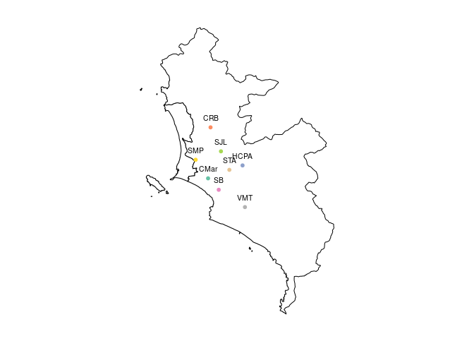
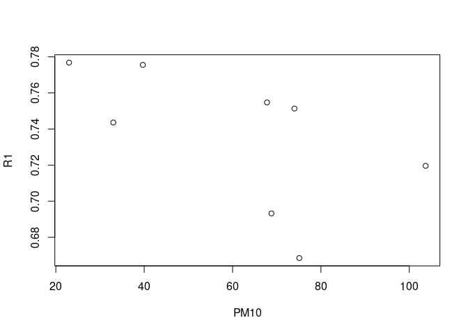

## Informe

### Librerias

```r
library(sf)
```

```
## Linking to GEOS 3.10.2, GDAL 3.4.1, PROJ 8.2.1; sf_use_s2() is TRUE
```

```r
library(terra)
```

```
## terra 1.6.17
```
### Lectura de archivos externos


```r
### Lectura de las bandas del satelite
banda1<-rast('LC08_L1TP_007068_20220828_20220910_02_T1/LC08_L1TP_007068_20220828_20220910_02_T1_B1.TIF')
banda2<-rast('LC08_L1TP_007068_20220828_20220910_02_T1/LC08_L1TP_007068_20220828_20220910_02_T1_B2.TIF')
banda3<-rast('LC08_L1TP_007068_20220828_20220910_02_T1/LC08_L1TP_007068_20220828_20220910_02_T1_B3.TIF')
banda4<-rast('LC08_L1TP_007068_20220828_20220910_02_T1/LC08_L1TP_007068_20220828_20220910_02_T1_B4.TIF')

### Maximos y minimos para cada banda, estos valores no aparecen por defecto.
setMinMax(banda1)
setMinMax(banda2)
setMinMax(banda3)
setMinMax(banda4)

### Lectura del archivo que contiene el mapa del Peru
Peru<-read_sf('gadm41_PER_shp/gadm41_PER_1.shp')
```

### Creacion de coordenadas y variables


```r
### Coordenadas de las estaciones, longitud y latitud
est1<-st_point(c(-77.03364,-11.90219)) # Carabayllo
est2<-st_point(c(-77.08447,-12.00889)) # SMP
est3<-st_point(c(-77.04322,-12.07054)) # Campo de Marte
est4<-st_point(c(-77.00769,-12.10859)) # San Borja
est5<-st_point(c(-76.92706,-12.02869)) # Huachipa
est6<-st_point(c(-76.97144,-12.04302)) # Sta Anita
est7<-st_point(c(-76.99925,-11.98164)) # SJL
est8<-st_point(c(-76.92,-12.16639)) # VMT

### Transformacion de las estaciones como datos geometricos, proyeccion de las coordendas
estcs<-st_sfc(est1,est2,est3,est4,est5,est6,est7,est8,crs=4326)
estcs_p<-st_transform(estcs,crs(banda1))

### Extraccion de los datos de cada banda , correspondiente a cada estacion
B1<-extract(banda1,st_sf(estcs_p))[,2]
B2<-extract(banda2,st_sf(estcs_p))[,2]
B3<-extract(banda3,st_sf(estcs_p))[,2]
B4<-extract(banda4,st_sf(estcs_p))[,2]

### Definicion del data frame
ests_atrib<-data.frame(
        Lugar=c('CRB','SMP','CMar','SB','HCPA','STA','SJL','VMT'),
        Fecha='28/08/2022',
        PM10=c(74,33,23,103.7,68.8,67.8,75.1,39.7),B1,B2,B3,B4)
ests_sf<-st_sf(ests_atrib,geometry=estcs_p)

### Mapa de Lima Metropolitana, proyectado a las mismas coordenadas de los datos satelitales
Lima<-st_transform(Peru[c(7,16),4],crs(banda1))

### Reflactancia atmosferica calculada a partir de la banda 1
### Calculos similares se haran para las otras bandas
R1<-(B1*(2e-5)-0.1)/sin(54.43208851*pi/180)
```

### El conjunto de Datos


```r
### Conjunto de datos 
ests_sf
```

```
## Simple feature collection with 8 features and 7 fields
## Geometry type: POINT
## Dimension:     XY
## Bounding box:  xmin: 273047.9 ymin: -1345691 xmax: 291083.7 ymax: -1316549
## Projected CRS: WGS 84 / UTM zone 18N
##   Lugar      Fecha  PM10    B1    B2    B3    B4                  geometry
## 1   CRB 28/08/2022  74.0 35558 36114 35372 36844 POINT (278497.5 -1316549)
## 2   SMP 28/08/2022  33.0 35243 35711 34691 36040 POINT (273047.9 -1328396)
## 3  CMar 28/08/2022  23.0 36594 37166 36290 37757 POINT (277591.6 -1335183)
## 4    SB 28/08/2022 103.7 34267 34551 33589 34829 POINT (281491.5 -1339365)
## 5  HCPA 28/08/2022  68.8 33195 33874 33319 34901 POINT (290207.8 -1330462)
## 6   STA 28/08/2022  67.8 35695 36298 35537 37057   POINT (285386 -1332081)
## 7   SJL 28/08/2022  75.1 32189 32556 31815 33086 POINT (282308.1 -1325312)
## 8   VMT 28/08/2022  39.7 36542 37131 36276 37753 POINT (291083.7 -1345691)
```

### Algunos gráficos


```r
### Ubicacion de las estaciones
plot(Lima,reset=F,col='white',main='')
plot(ests_sf[,1],add=T,pch=20)
text(st_coordinates(estcs_p),labels=ests_sf[,1]$Lugar,pos=3,cex=0.65)
```

<!-- -->


```r
### Reflactancia versus concentracion de PM10
plot(ests_sf[,3]$PM10,R1,xlab='PM10')
```

<!-- -->

